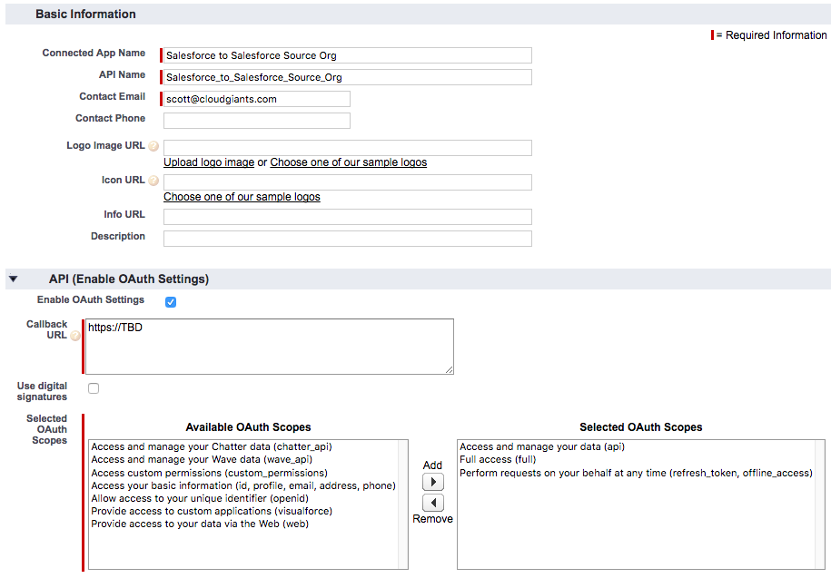

Salesforce-to-Salesforce Config

Connected App, Auth Provider, Named Credential

This document accompanies the Dreamforce 2016 session titled [Publishing Data to REST APIs with Lightning Process Builder](https://success.salesforce.com/Sessions?eventId=a1Q3000000qQOd9#/session/a2q3A000000LBSAQA4)

* In the target org, create a Connected App to allow the source org to authenticate via OAuth 2.0

    * Navigate to Setup -> Build -> Create -> Apps

    * Next to "Connected Apps" click New

    * Fill in required Basic Information fields

    * Check the "Enable OAuth Settings" box

        * Enter "https://TBD" for Callback URL - we will update this later

        * Apply "Selected OAuth Scopes" as shown below

    * Click Save

    * Take note of the Consumer Key and Consumer Secret (treat this secret like you would a password)

* In the source org, create an Auth Provider to allow access to the target org

    * Navigate to Setup -> Administer -> Security Controls -> Auth Providers

    * Next to "Auth Providers" click New

    * Select Salesforce as the provider type, then provide a name and URL suffix

    * Fill in the Consumer Key and Consumer Secret as noted during creation of the Connected App in the target org

    * Authorize Endpoint URL is [https://login.salesforce.com/services/oauth2/authorize](https://login.salesforce.com/services/oauth2/authorize)

    * Token Endpoint URL is [https://login.salesforce.com/services/oauth2/token](https://login.salesforce.com/services/oauth2/token)

    * Default Scopes is "refresh_token full"

    * Click "Automatically create a registration handler"

    * Execute Registration As should be selected (pick a System Admin or similar user)

    * Click Save

    * Take note of the Callback URL

* In the target org, update the Connected App

    * Navigate to Setup -> Build -> Create -> Apps

    * Click Edit next to your Connected App

    * Update the Callback URL to the value noted during creation of your Auth Provider in the source org

* In the source org, create a Named Credential to be used by your Apex code to connect to the target org

    * Navigate to Setup -> Administer -> Security Controls -> Named Credentials

    * Click New

    * Provide a Label, Name, and the URL for the target org (in the example below I have enabled mydomain in the target org, so I'm using that URL)

    * Identity Type should be Named Principal - this means regardless of which user is logged in to the source org, a single user will be used to access the target org

    * Authentication Protocol - select OAuth 2.0

    * Authentication Provider - select the Auth Provider you created earlier

    * Scope - refresh_token full

    * Start Authentication Flow on Save - checked

    * Generate Authorization Header - checked

    * Click Save (if you get an error here, you may need to wait a few more minutes for you last update to the Connected App in the target org to propagate and try again)

    * At the login prompt, log in with the username and password for the target org

    * On the Allow Access screen click Allow

* Log out of the target org and log back into the source org to verify successful setup

    * Navigate to Setup -> Administer -> Security Controls -> Named Credentials

    * Click on your Named Credential to view the details

    * Authentication Status	should now say "Authenticated as [your target org username]" - you are ready to reference this Named Credential in your Salesforce-to-Salesforce Apex code!

